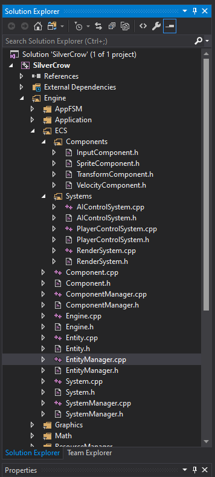

# SilverCrow

A project where I was focused on learning the consept of ESC (Entity-System-Component). This allows game objects to be highly customizeable as enties just contains data to correlate between component-system.

Tags: C++, Game, ESC, FSM, Animation
